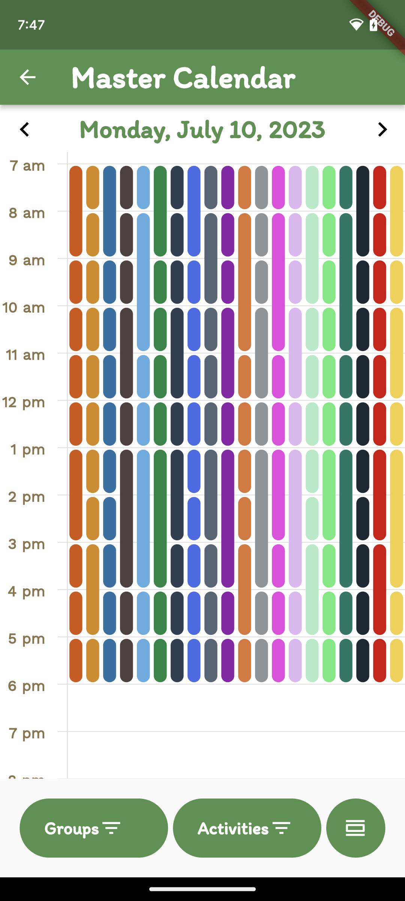

# Lake Nixon Schedule App

A planning app for the Lake Nixon Summer Camp in Little Rock, AR.

This app is designed to make planning for each day of camp easier for the camp administrators and make this information easily accessible to parents and camp councelors who want to know what the different groups of campers are doing everyday. 

Users log in and it separates them based on if they are administrators or users.

**Administrators:**

- The administrators can access a master calendar and create events for the various groups to do.

- These events have various restrictions that make sure that too many groups, or groups of the wrong ages, are not assigned to these events.

- Just like the users, the administrators can also view the individual group calendars as they're being created.

**Users**

- Users have the ability to view a list of groups in the camp

- List View of Groups

- Specific Group Calendar

